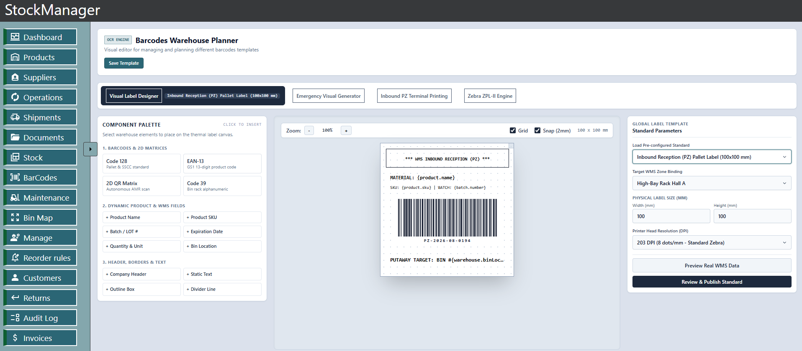
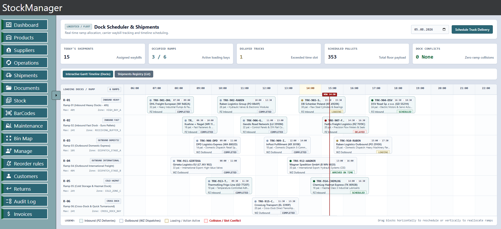
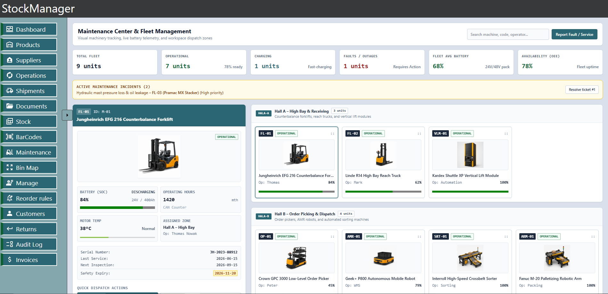

# StockManager

StockManager is a full-stack warehouse, inventory, and supplier management system implemented with a React frontend and an ASP.NET Core backend.

## Key Features

- Full REST API backend built with ASP.NET Core 8
- React + Vite frontend with inventory, product, supplier, maintenance, and document workflows
- Entity Framework Core with SQL Server persistence
- Redis caching and RabbitMQ messaging support
- API versioning and Swagger documentation
- Health checks and telemetry-ready middleware
- In-memory test support for automated integration tests

## Repository Structure

- `REST API/` — ASP.NET Core backend solution and related projects
  - `StockManager/` — main API application
  - `StockManager.Application/` — application services, CQRS handlers, DTOs, validation, and mappings
  - `StockManager.Core.Domain/` — domain entities, enums, interfaces, and business logic
  - `StockManager.Infrastructure/` — persistence, repositories, and infrastructure services
  - `StockManager.Tests/` — integration and unit tests for the backend
  - `StockManager.Application.Tests/` — application-layer unit tests
- `Frontend/` — React frontend application
- `Makefile` — quick local run commands

## Tech Stack

- Backend: ASP.NET Core 8, Entity Framework Core, Serilog, OpenTelemetry, Swagger
- Frontend: React, Vite, Tailwind CSS, React Router, React Query, Axios
- Infrastructure: SQL Server, Redis, RabbitMQ

## Local Setup

### Prerequisites

- [.NET 8 SDK](https://dotnet.microsoft.com/download/dotnet/8.0)
- [Node.js](https://nodejs.org/)
- [Docker](https://www.docker.com/)
- [Docker Compose](https://docs.docker.com/compose/)

### Recommended Local Run

From the repository root, use the provided Makefile commands:

```bash
make backend
```

This command will:

- start required Docker containers for SQL Server, RabbitMQ, and Redis
- wait for the infrastructure to become available
- apply Entity Framework migrations
- launch the ASP.NET Core backend

```bash
make frontend
```

This starts the frontend development server in `Frontend/` using Vite.

### Frontend Manual Start

```bash
cd Frontend
npm install
npm run dev
```

### Backend Manual Start

```bash
cd "REST API/StockManager"
dotnet run
```

## Environment Variables

The backend expects configuration values via environment variables or `REST API/.env`.

Typical values include:

```env
MSSQL_SA_PASSWORD=YourStrong!Passw0rd
JWT__KEY=YourSuperSecretKeyHere...
JWT__ISSUER=StockManager
JWT__AUDIENCE=StockManager
REDIS__HOST=localhost
RABBITMQ__HOST=localhost
RABBITMQ__USERNAME=guest
RABBITMQ__PASSWORD=guest
```

## Testing

Run backend tests from `REST API/StockManager.Tests`:

```bash
cd "REST API/StockManager.Tests"
dotnet test
```

The project includes both integration tests and application-level unit tests.

## API Documentation

When the backend is running in development, Swagger is available at:

```text
http://localhost:5000/swagger/index.html
```

## Screenshots







## Notes

- The React frontend uses mock and internal APIs for several demo screens and data workflows.

## License

This repository does not contain explicit license metadata. Review project files for any license details before using or distributing.
