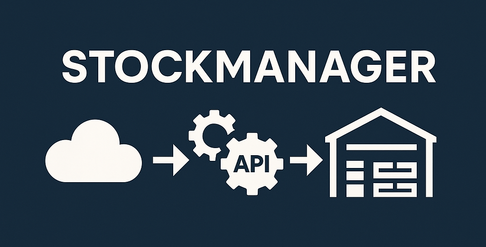

# StockManager

**StockManager** – backend (ASP.NET Core/.NET 8) for warehouse inventory management, built with **Clean Architecture + CQRS (MediatR)**, logging (**Serilog**), and observability (**OpenTelemetry**).  
Project runs locally via **Docker Compose** (API + MS SQL Server + Redis). In the cloud, it operates as **Azure Container Apps** with supporting resources (SQL Database, Storage – Azure Files, Container Registry, Key Vault, Application Insights, etc.).

  

## Table of Contents
- [Architecture & Layers](#architecture--layers)
- [Prerequisites](#prerequisites)
- [Quickstart – Local (Docker Compose)](#quickstart--local-docker-compose)
- [Configuration - local connection string](#configuration--local-connection-string)
- [Tests](#tests)
- [NuGet Packages](#nuget-packages)
- [Azure Deployment](#azure-deployment)
- [Screenshots](#screenshots)
- [Known Limitations / Tips](#known-limitations--tips)
- [License](#license)

---

## Architecture & Layers

The repository (`REST API/`) is divided into projects:

- **StockManager.Core.Domain** – domain models/entities.
- **StockManager.Application** – application logic, **CQRS** (commands/queries), **MediatR**, validation, etc.
- **StockManager.Infrastructure** – data access (**EF Core** for Azure SQL), integrations (e.g., Redis), interface implementations.
- **StockManager** – **ASP.NET Core Web API** app (endpoints, DI config, Serilog, OTEL).
- **StockManager.Application.Tests / StockManager.Tests** – unit/integration tests (xUnit).
- Files: `docker-compose.yml`, `docker-compose.override.yml`, `.env_template`, `Directory.Packages.props` (central NuGet versions), etc.

---

## Prerequisites

- **Docker Desktop** 4.x+
- **Docker Compose v2** (bundled with Docker Desktop)
- (Optional) **.NET 8 SDK** if you want to run the API outside Docker

---

## Quickstart – Local (Docker Compose)

1. Clone the repo and go to the `REST API/` directory.

2. Create a `.env` file from `.env_template` and fill in required variables.

3. Build and run the stack:

   ```bash
   docker compose up --build -d
   ```
   This command will:

   - Pull images for mssql/server:2022-latest and redis:7-alpine,
   - Build the stockmanager:latest image (your API),
   - Start 3 containers: stockmanager-sql (1433), redis (6379), stockmanager (API – mapped to e.g., http://localhost:5000 / http://localhost:8080 as per compose).

   Check containers:
   ```bash
   docker ps
   # Or use Docker Desktop UI
   ```

   API:
   - Swagger/HTTP: http://localhost:5000 (or the port you set in compose – use "Show all ports" in Docker Desktop).
   - If using HTTPS – the relevant port is visible in Docker Desktop/compose.

   Note: First SQL Server startup may take up to a minute. If API starts before SQL is ready, compose includes `depends_on`, but sometimes it's best to give SQL a moment before API migrations.

---

## Configuration – local connection string

```bash
  Server=stockmanager-sql,1433;Database=StockManagerDb;
  User Id=sa;Password=<YourSAPassword>;
  TrustServerCertificate=True;Encrypt=False;
```

## Tests

The repository contains xUnit tests. In Visual Studio or CLI:

```bash
dotnet test
```


The Dockerfile (test stage) also builds and runs tests – you can see statuses in build logs.

---

## NuGet Packages

Main dependencies used in the project (based on structure/config):

**Runtime / Infrastructure**
- Microsoft.EntityFrameworkCore
- Microsoft.EntityFrameworkCore.SqlServer
- Microsoft.EntityFrameworkCore.Tools
- StackExchange.Redis or Microsoft.Extensions.Caching.StackExchangeRedis
- MediatR / MediatR.Extensions.Microsoft.DependencyInjection
- Serilog / Serilog.Extensions.Hosting / Serilog.Sinks.Console
- OpenTelemetry.Extensions.Hosting
- OpenTelemetry.Instrumentation.AspNetCore
- OpenTelemetry.Instrumentation.Http
- OpenTelemetry.Instrumentation.Runtime
- OpenTelemetry.Exporter.OpenTelemetryProtocol
- Azure.Identity, Azure.Monitor.OpenTelemetry.Exporter
- Microsoft.AspNetCore.Authentication.JwtBearer

**Validation / Mapping**
- FluentValidation / FluentValidation.DependencyInjectionExtensions
- AutoMapper / AutoMapper.Extensions.Microsoft.DependencyInjection

**Testing**
- xunit
- xunit.runner.visualstudio
- FluentAssertions
- Moq

---

## Azure Deployment

The backend runs as Azure Container Apps (ACA), the app image is pushed to Azure Container Registry (ACR).
Environment consists of:

- Azure Container Apps – API container host
- Azure Container Registry – Docker image registry
- Azure SQL Server + Azure SQL Database – database
- Azure Storage – Azure Files – file shares
- Azure Key Vault – secrets
- Application Insights (+ Log Analytics Workspace) – telemetry & logs
- Managed Environment (Container Apps) – ACA environment
- Azure DevOps – CI/CD (service connections: Azure subscription, ACR, GitHub)

---

## Screenshots

- **Local (Docker Desktop):**  
  
  

- **ACA:**
  
  
  

- **Resource Group – all services:**  
  

- **Azure Files – file share:**  
  

- **Build & push (PowerShell):**  
  
  

- **Azure DevOps – service connections:**  
  

- **xUnit tests – passing:**  
  

- Also repository has a **lockage** to push commits to main branch.
  
---

## Known Limitations / Tips

- Azure SQL (free/serverless) can quickly exhaust free quota if the app keeps connections alive.
- For demo: resume the database briefly (Compute + Storage → Continue using database with additional charges), and stop after demo (or set autopause).
- In the app, separate readiness/liveness checks from DB tests and add exponential backoff for SQL errors.
- Store secrets in Key Vault (+ Managed Identity in ACA).
- For monitoring, send OTEL data to Application Insights.

---

## License

MIT 
